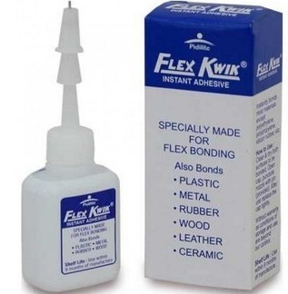
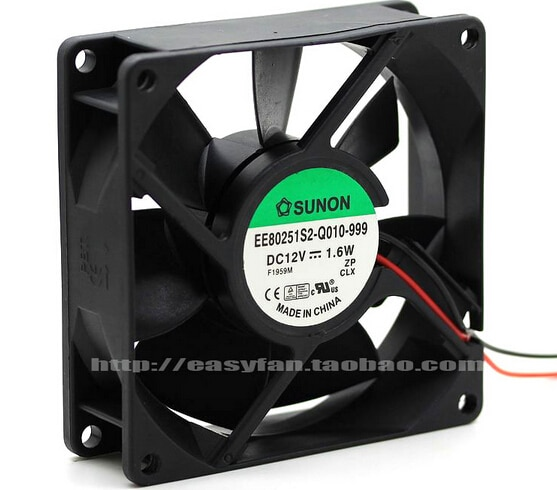
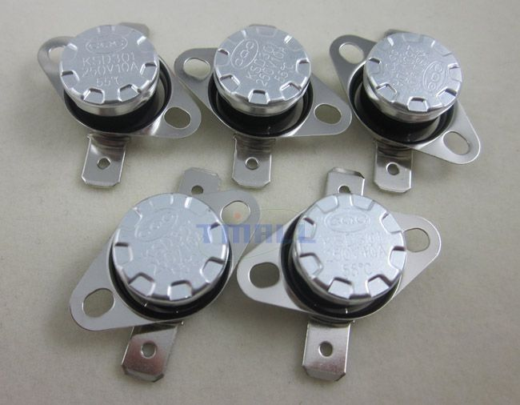

#### Fixing loose RTL-SDR Blog V.3. Dongle

RTL-SDR Blog V.3. Dongle parts are held together with four loose tiny screws,
which often become undone even after a single use!

I used the `Pidilite Flex Kwik` adhesive to glue together the parts which were
held together by these four screws.

This hack seems to be working well so far.

#### Reducing DC fan's acoustic noise

My `Pulse SMPS` uses a very noisy `Sunon EE80251S2-1000U-999 - 12V, 2900
RPM` fan. This fan is fed `12v` using two wires.

To reduce the noise, I am planning to introduce a `100 / 120 ohm` resistor in
series by splicing the red wire. A thermal switch (NO) is connected in parallel
to this resistor.

The thermal switch needs to be clamped (using screws) to the top fin (portion)
of the heat sink. The top fin needs two drill holes for clamping the thermal
switch to it.

Part list,

* 2 watt 100 or 120 ohm resistor. 130/150 ohm might also work (with more reduction in noise).

* 3x8mm screws (3x6mm screws might work better)

* Heat shrink tubing (optional)

* Thermal Switch, Normally Open (NO), KSD301, 50 or 55 degrees - from eBay

* Drill machine with a proper metal-drill-capable bit (approx. 25mm pitch, buy various sizes)

* Extra wire for connecting the thermal switch - 1 meters should be enough

* Cooler Master Thermal Paste (Thermal Grease) - optional

Tools used: Soldering iron, solder, flux, DMM (optional, for verification), thin nose pliers

Reference: I used [this article](http://www.pcbheaven.com/circuitpages/A_Simple_Way_To_Reduce_A_DC_Fan_Speed/)
as a reference. Special thanks goes to VU2ASH for suggesting me to use a thermal switch.

