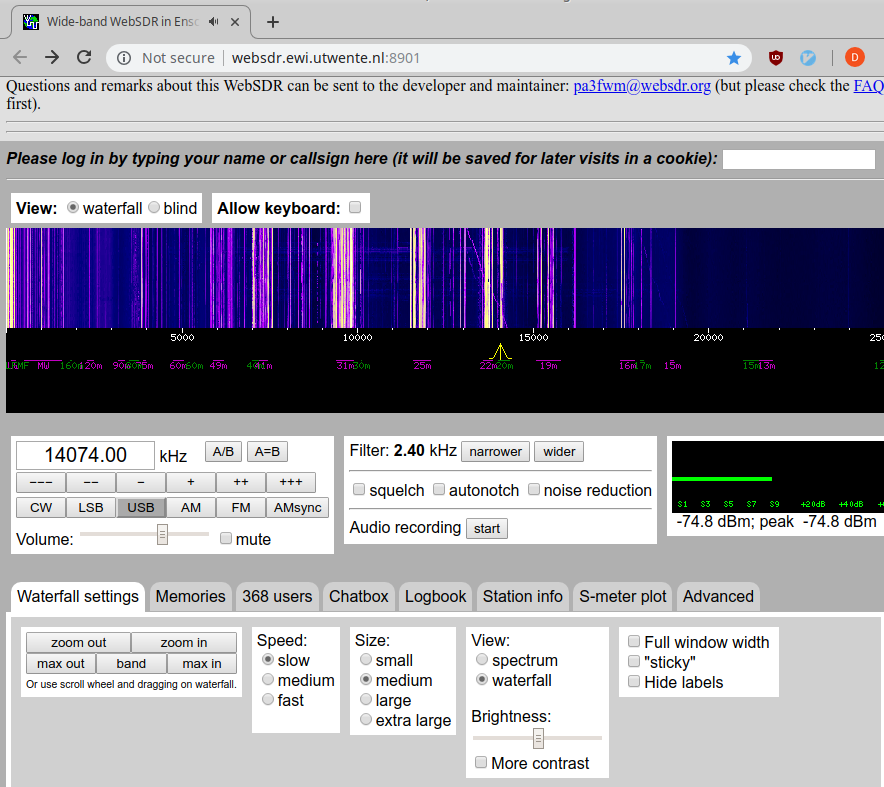
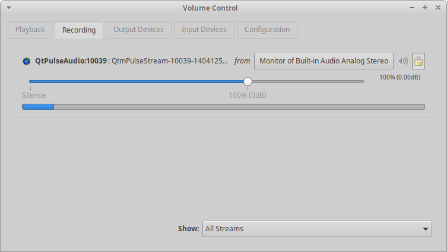
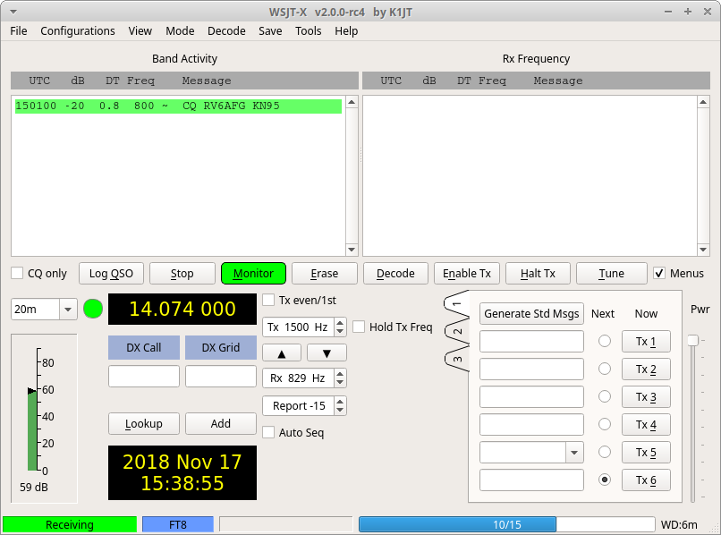
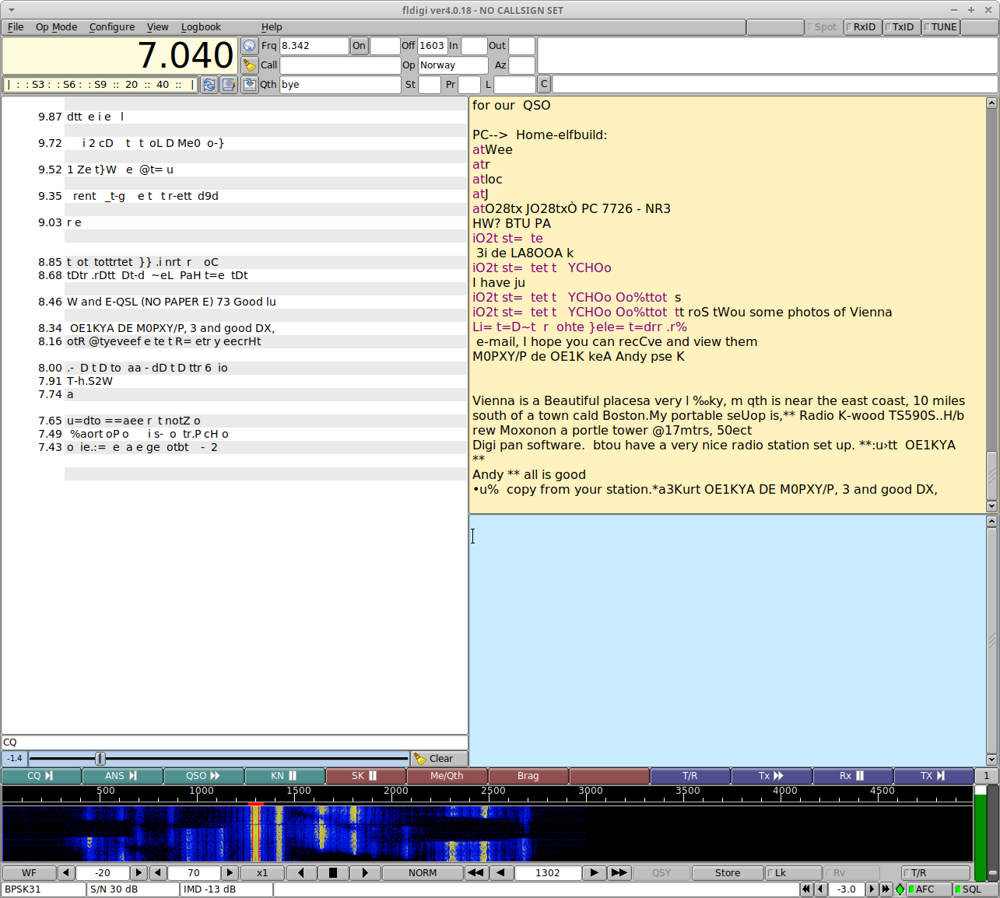

#### Listen to digital modes without any radio

1. Open http://websdr.ewi.utwente.nl:8901/ (or any other WebSDR site) and tune
   to the desired digital frequency.

   Select `USB` mode on the WebSDR site.

   https://www.qsl.net/sv1grb/psk31.htm has a list of digital frequencies.

   Example: Tune to 14074.0 KHz and select `USB mode`. You should be able to
   hear some old modem styles sounds now. This is a FT8 frequency.

   

2. Launch `WSJT-X 2.0` and set it to `20m`.

3. In the `Recording` tab of `pavucontrol` program on Linux, set the input of
   `WSJT-X` to `Monitor of <your output audio device>`.

   

4. In `WSJT-X` you should be able to see the populated waterfall and some
   FT8 data.

   

5. Let's try `BPSK-31` mode now. Tune the WebSDR to 7040 KHz.

6. Launch `fldigi`, set frequency to 7040 KHz, set `Op Mode` to `BPSK-31`,
   select `PortAudio` in `Configure -> Sound Card` option.

7. In the `Recording` tab of `pavucontrol` program on Linux, set the input of
   `fldigi` to `Monitor of <your output audio device>`.

8. You should now be able to see a populated waterfall and maybe some QSOs in
   `fldigi`.

   

#### Credits

Thanks to Anil Sharma (VU2TFG) for suggesting this idea to me.
